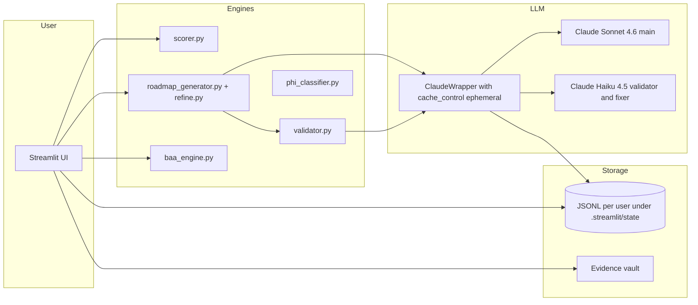

# HIPAA Readiness Agent

Streamlit app that produces an end-to-end HIPAA readiness assessment, prioritized
remediation roadmap, BAA outreach drafts, and persistent compliance state for any
US healthcare entity that handles protected health information.

[](https://hipaa-readiness.streamlit.app)
[](https://github.com/cyrillical00/hipaa-readiness-agent)
[](https://www.python.org/)
[](#license)


> Screenshots are TODO. Add `docs/screenshots/gap_assessment_meridian.png` (≈800px wide) once the demo personas land.

## What it does

Scores 62 controls across all three HIPAA rules (Security, Privacy, Breach
Notification) with real 45 CFR citations rendered in the UI, the roadmap, and
the docx export. A pluggable connector layer pulls signals from Okta, AWS, GCP,
Google Workspace, Jamf, Kandji, Intune, GitHub, Jira, and Confluence, with
manual CSV upload for everything else. Claude generates a phased remediation
roadmap behind a 3-pass refine loop (generator, validator, fixer) so the output
is structurally clean before it ever lands on screen. Every assessment, evidence
artifact, and roadmap revision persists per user with an audit log and a daily
spend cap, and the whole thing exports to docx for board or auditor review.

## Why it exists

Small healthcare orgs and Business Associates do not have $10k+/yr to spend on
Vanta or Drata, but they still need to demonstrate HIPAA readiness when a hospital
customer asks for it. This tool gives them an honest, evidence-backed assessment
plus a roadmap they can actually work, in an afternoon, with cost transparency
on every Claude call.

## Live demo

[hipaa-readiness.streamlit.app](https://hipaa-readiness.streamlit.app)

Three personas to explore (use any allow-listed email at the login gate):

| Persona | Type | Workforce | What to look at |
|---|---|---|---|
| **Meridian Health Tech** | Business Associate SaaS | 150 | BAA Tracker shows 5 critical gaps. Open the Roadmap and watch how those cascade into Phase 1 priority work. |
| **Brookline Cardiology** | Small Covered Entity | 25 | Strong Privacy Rule maturity, weaker Security Rule. The PHI weighting in the scorer downweights physical controls because ePHI does not leave the org. |
| **Northeast Health Network** | Both, mature | 800 | SOC2 Type II Complete. Most controls Implemented. The interesting work is in Breach Notification, which a recent reorg left unclear. |

## How it works

### Architecture



### The refine loop

The roadmap generator drafts a phased plan with Sonnet, then hands it to a
Haiku-backed validator that checks JSON shape, phase ordering, control coverage,
and effort balance. If validation fails, a Haiku fixer takes the draft plus the
validator's findings and patches it. The loop runs up to three passes. Every
system prompt is sent with `cache_control: ephemeral` so repeated calls share the
prompt cache. If the fixer cannot produce a valid roadmap inside the budget, the
last good roadmap is kept and the user sees a banner explaining why.

### Scoring with PHI weighting

Each control's contribution to the overall score is weighted between 0.5 and 2.0
by its ePHI relevance for the org. High-risk controls for systems that touch
ePHI carry a 2.0 multiplier. Controls tied to the org's connected sources carry
1.5. Physical safeguards drop to 0.5 when ePHI does not leave the org and no
on-prem systems are listed. Everything else stays at 1.0. The result is that a
cloud-only Business Associate is not punished for missing badge readers, and a
clinic with paper records is not flattered by strong cloud encryption.

### Persistence and RBAC

Per-user JSONL files live under `.streamlit/state` by default, one stream per
record kind (assessments, evidence, audit, spend). Optional GitHub-backed storage
swaps in when `HIPAA_STATE_REPO` and `HIPAA_STATE_PAT` are set, which is how
shared deployments keep state across restarts. Roles are defined in
`auth/roles.json` with daily spend caps enforced before every Claude call:
admin unlimited, editor $10/day, contributor $2/day, viewer $0/day (read-only).

## What's included

### 62 controls across all 3 HIPAA rules

| Rule | Controls | CFR range |
|---|---|---|
| Security Rule | 42 (23 Administrative, 10 Physical, 9 Technical) | 45 CFR §164.300 to §164.318 |
| Privacy Rule | 13 | 45 CFR §164.500 to §164.534 |
| Breach Notification Rule | 7 | 45 CFR §164.400 to §164.414 |

Every control carries a real CFR citation rendered in the UI, the roadmap, and the docx export.

### Connectors

All connectors are read-only. Demo mode uses cached fixtures so reviewers can poke around without provisioning anything.

- **Okta** · MFA enforcement, unique user IDs, session timeout, password policy
- **AWS** · S3 encryption, CloudTrail, KMS, log retention
- **GCP** · IAM, KMS, audit logging, Cloud Storage encryption
- **Google Workspace** · Email TLS, DLP, audit log retention, BAA status
- **Jamf** and **Kandji** · FileVault coverage, screen lock, MDM enrollment
- **Intune** · BitLocker coverage, compliance policy
- **GitHub** · 2FA requirement, branch protection, secret scanning
- **Jira** · Open HIPAA tickets, remediation SLA tracking
- **Confluence** · Policy doc presence, last-reviewed dates
- **Manual CSV upload** · Template-based upload for any control

### Pages

| Page | Purpose |
|---|---|
| Integrations | Connect data sources or pick a demo persona |
| Gap Assessment | Score all 62 controls with PHI weighting and per-control evidence vault |
| BAA Tracker | Vendor inventory, risk classification, Claude outreach drafts |
| SOC2 Overlap | Crosswalk showing which HIPAA controls SOC2 work already covers |
| Remediation Roadmap | Claude-generated 3-phase plan with refine loop, progress tracking, re-assess and diff, docx export |
| History | Past assessments per user, audit log, today's spend |

## Comparison to commercial tools

| Capability | This tool | Vanta | Drata |
|---|---|---|---|
| Price | Free, self-hosted | ~$11k+/yr | ~$10k+/yr |
| All 3 HIPAA rules | Yes | Security only | Security only |
| BAA outreach drafts | Yes (Claude) | Manual templates | Manual templates |
| Open evidence model | Yes (filesystem) | Vendor lock-in | Vendor lock-in |
| LLM transparency | Per-call cost panel and audit log | Black box | Black box |
| Continuous monitoring | No (point-in-time plus re-assess diff) | Yes | Yes |

This tool is for orgs that do not yet justify a $10k+/yr platform and want an honest, evidence-backed read.

## Run it

### Quick start (local)

```bash
git clone https://github.com/cyrillical00/hipaa-readiness-agent
cd hipaa-readiness-agent/hipaa
pip install -r requirements.txt
cp .streamlit/secrets.toml.example .streamlit/secrets.toml
# add your ANTHROPIC_API_KEY
streamlit run app.py
```

Open http://localhost:8501 and pick `Meridian Health Tech` from the persona selector.

### Deploy to Streamlit Community Cloud

1. Fork this repo.
2. Sign in at https://share.streamlit.io.
3. Click `New app`, point at your fork, set the main file to `hipaa/app.py`.
4. Under `Settings`, then `Secrets`, paste the contents of `.streamlit/secrets.toml.example` and fill in real values for `ANTHROPIC_API_KEY` and `local_allowed_emails`.
5. Click Deploy. First boot installs requirements (~2 minutes).
6. The docx export works out of the box. Optional PDF download requires LibreOffice (`soffice`) on the host. Streamlit Community Cloud does not preinstall it, so the PDF button is hidden there. To enable PDF, deploy on a host with `soffice` on the PATH (Render, Railway, or your own server with `apt install libreoffice`).

### Required and optional secrets

| Key | Required? | Purpose |
|---|---|---|
| `ANTHROPIC_API_KEY` | Yes | Claude calls (assessment, roadmap, validator, fixer, BAA drafts) |
| `local_allowed_emails` | Local dev only | Emails allowed past the local login gate (Cloud uses Google OAuth) |
| `HIPAA_STATE_REPO` | Optional | GitHub repo for shared persistence (defaults to local disk) |
| `HIPAA_STATE_PAT` | Optional | PAT with `repo` scope on the state repo |

## Testing

### QA replay harness

```bash
cd hipaa
python qa/runner.py --replay        # default: cached responses, free, ~30 sec
python qa/runner.py --live          # hit Anthropic, ~$0.50, ~3 min, populates qa/replays/
python qa/runner.py --case meridian # filter to one case
```

Five fixtures cover:

1. Meridian demo (BA SaaS, 5 critical BAA gaps)
2. Empty greenfield org (zero connectors, zero evidence)
3. Mature SOC2 Type II org (most controls Implemented)
4. Small Covered Entity with mixed evidence
5. BA in BAA crisis (no current agreements on file)

Each case asserts the JSON shape of both Claude calls and runs the validator on the produced roadmap.

## Roadmap (this project, not the tool's output)

| Phase | Status | What landed |
|---|---|---|
| 5 cache_control plus validator plus QA harness | shipped | PR #1 |
| 6 Persistence plus RBAC plus audit log | shipped | PR #2 |
| 7 CFR citations plus Privacy and Breach plus evidence vault | shipped | PR #3 |
| 8 Refine loop plus roadmap progress plus BAA outreach | shipped | PR #4 |
| 9 docx export plus demo personas plus portfolio polish | shipped | this PR |

Future:

- Wire GitHub-backed JSONL state for shared deployments end-to-end
- Continuous monitoring via scheduled re-assessment (cron)
- Webhook to Slack on critical control regression

## Disclaimer

This tool assists with HIPAA readiness self-assessment. It does not constitute
legal advice. Engage qualified counsel for your specific compliance posture.

## License

MIT.

## Author

Oleg Strutsovski. Portfolio: https://olegstrutsovski.com.
